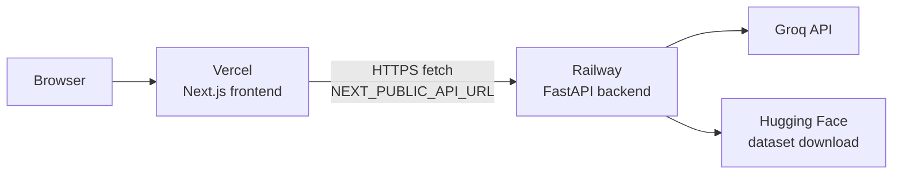

# Deployment Plan

This document describes how to deploy the **Zomato AI Restaurant Recommendation System** with:

| Component | Platform | Stack |
|-----------|----------|-------|
| Backend API | [Railway](https://railway.app/) | Python 3.11+, FastAPI, Uvicorn |
| Frontend UI | [Vercel](https://vercel.com/) | Next.js 16, React 19 |

Deploy the **backend first**, then the **frontend**. The frontend needs the Railway public URL to call the API, and the backend needs the Vercel URL in `CORS_ORIGINS`.

---

## Architecture (Production)



**Request flow**

1. User opens the Vercel-hosted Next.js app.
2. The browser calls the Railway API directly (`frontend/lib/api.ts` uses `NEXT_PUBLIC_API_URL`).
3. On startup, Railway downloads (or re-downloads) the Zomato dataset from Hugging Face and caches it locally.
4. Recommendation requests go through the filter pipeline and Groq LLM.

---

## Prerequisites

Before deploying, gather:

| Item | Where to get it |
|------|-----------------|
| GitHub repo connected to Railway and Vercel | Push this project to GitHub |
| **Groq API key** (required) | [Groq Console](https://console.groq.com/) |
| Railway account | [railway.app](https://railway.app/) |
| Vercel account | [vercel.com](https://vercel.com/) |

No Hugging Face token is required for the public dataset `ManikaSaini/zomato-restaurant-recommendation`.

---

## Part 1 — Backend on Railway

### 1.1 Create the Railway service

1. Log in to [Railway](https://railway.app/) and click **New Project**.
2. Choose **Deploy from GitHub repo** and select this repository.
3. Railway auto-detects Python via `requirements.txt` at the repo root.

**Important:** Do **not** set the root directory to `frontend`. The backend lives at the repository root (`src/`, `requirements.txt`).

### 1.2 Configure the start command

Railway injects a dynamic `PORT`. Uvicorn must bind to `0.0.0.0` and that port.

In the service **Settings → Deploy → Start Command**, set:

```bash
uvicorn src.api.app:app --host 0.0.0.0 --port $PORT
```

Alternatively, add a `Procfile` at the repo root (Railway reads it automatically):

```
web: uvicorn src.api.app:app --host 0.0.0.0 --port $PORT
```

Do **not** use `python src/main.py` in production — that entry point hard-codes port `8000` and enables `--reload`.

### 1.3 Set environment variables

In Railway **Variables**, add:

| Variable | Required | Example / notes |
|----------|----------|-----------------|
| `GROQ_API_KEY` | **Yes** | Your Groq secret key |
| `GROQ_MODEL` | No | `llama-3.3-70b-versatile` (default) |
| `GROQ_TEMPERATURE` | No | `0.3` |
| `HF_DATASET_NAME` | No | `ManikaSaini/zomato-restaurant-recommendation` |
| `DATA_CACHE_PATH` | No | `data/restaurants.parquet` |
| `MAX_CANDIDATES_FOR_LLM` | No | `20` |
| `TOP_K_RECOMMENDATIONS` | No | `5` |
| `BUDGET_LOW_MAX` | No | `500` |
| `BUDGET_MEDIUM_MAX` | No | `1500` |
| `CORS_ORIGINS` | **Yes (after Vercel)** | See [CORS setup](#cors-setup) below |

Reference: `.env.example` at the repo root and `src/config.py`.

### 1.4 Generate a public domain

1. Open the Railway service → **Settings → Networking**.
2. Click **Generate Domain** (e.g. `https://zomato-api-production.up.railway.app`).
3. Save this URL — you will use it as `NEXT_PUBLIC_API_URL` on Vercel.

### 1.5 First deploy behavior

On the first boot (and after every redeploy), the backend:

1. Attempts to load `data/restaurants.parquet` from the local filesystem.
2. If missing, downloads the dataset from Hugging Face (can take **30–90+ seconds**).
3. Preprocesses, deduplicates, and caches the parquet file.

**Railway uses an ephemeral filesystem** — the cache is lost on redeploy. The app handles this by re-downloading from Hugging Face. Expect slower cold starts after redeploys.

Optional hardening (not required for MVP):

- Attach a [Railway Volume](https://docs.railway.app/guides/volumes) mounted at `/app/data` and set `DATA_CACHE_PATH=data/restaurants.parquet` so the cache survives redeploys.
- Increase health-check timeout in Railway if deploys fail while the dataset is still downloading.

### 1.6 Verify the backend

Replace `YOUR_RAILWAY_URL` with your generated domain:

```bash
curl https://YOUR_RAILWAY_URL/api/v1/health
curl https://YOUR_RAILWAY_URL/api/v1/locations
curl https://YOUR_RAILWAY_URL/api/v1/cuisines
curl -X POST https://YOUR_RAILWAY_URL/api/v1/recommend \
  -H "Content-Type: application/json" \
  -d '{"location":"Indiranagar","budget":"medium","cuisine":"Italian","min_rating":4.0}'
```

Expected health response when healthy:

```json
{
  "status": "ok",
  "dataset_loaded": true,
  "restaurant_count": <number>
}
```

OpenAPI docs: `https://YOUR_RAILWAY_URL/docs`

---

## Part 2 — Frontend on Vercel

### 2.1 Import the project

1. Log in to [Vercel](https://vercel.com/) and click **Add New → Project**.
2. Import the same GitHub repository.
3. Configure the project:

| Setting | Value |
|---------|-------|
| **Framework Preset** | Next.js (auto-detected) |
| **Root Directory** | `frontend` |
| **Build Command** | `npm run build` (default) |
| **Output Directory** | `.next` (default) |
| **Install Command** | `npm install` (default) |

### 2.2 Set environment variables

In Vercel **Project → Settings → Environment Variables**:

| Variable | Environments | Value |
|----------|--------------|-------|
| `NEXT_PUBLIC_API_URL` | Production, Preview, Development | `https://YOUR_RAILWAY_URL` (no trailing slash) |

`NEXT_PUBLIC_*` variables are embedded at **build time**. After changing this value, trigger a **redeploy** on Vercel.

The frontend reads this in:

- `frontend/lib/api.ts` — browser `fetch` calls to the API
- `frontend/next.config.ts` — optional rewrites for `/api/*` paths

### 2.3 Deploy

Click **Deploy**. Vercel builds Next.js from the `frontend/` directory and assigns a URL such as `https://your-project.vercel.app`.

### 2.4 Verify the frontend

1. Open the Vercel production URL.
2. Confirm location and cuisine dropdowns populate (calls `GET /api/v1/locations` and `/cuisines`).
3. Submit a recommendation form and confirm results render with explanations.
4. Check the browser **Network** tab — API requests should go to your Railway domain, not `localhost:8000`.

---

## CORS setup

The FastAPI app allows origins listed in `CORS_ORIGINS` (`src/config.py` → `src/api/app.py`).

After Vercel is live, update Railway:

```env
CORS_ORIGINS=https://your-project.vercel.app,https://www.your-domain.com
```

Use comma-separated URLs with **no spaces** (or spaces are trimmed automatically).

**Preview deployments:** Vercel preview URLs look like `https://your-project-git-branch-user.vercel.app`. FastAPI CORS does not support wildcards — either:

- Add each preview URL manually to `CORS_ORIGINS`, or
- Use a single production frontend URL for demos, or
- Extend the backend later with dynamic origin validation for `*.vercel.app`.

Redeploy or restart the Railway service after updating `CORS_ORIGINS`.

---

## Deployment order checklist

Use this sequence to avoid CORS and missing-URL issues:

- [ ] **1.** Create Railway project from GitHub (repo root).
- [ ] **2.** Set Railway start command: `uvicorn src.api.app:app --host 0.0.0.0 --port $PORT`.
- [ ] **3.** Set `GROQ_API_KEY` (and optional tuning vars) on Railway.
- [ ] **4.** Generate Railway public domain.
- [ ] **5.** Wait for deploy; verify `/api/v1/health` returns `"status": "ok"`.
- [ ] **6.** Create Vercel project with **Root Directory = `frontend`**.
- [ ] **7.** Set `NEXT_PUBLIC_API_URL` to the Railway URL on Vercel.
- [ ] **8.** Deploy Vercel; note the production URL.
- [ ] **9.** Set `CORS_ORIGINS` on Railway to include the Vercel URL.
- [ ] **10.** Redeploy Railway (or restart) and re-test the full UI flow.

---

## Environment variable reference

### Backend (Railway)

| Variable | Default | Description |
|----------|---------|-------------|
| `GROQ_API_KEY` | — | Groq API key (**required** for recommendations) |
| `GROQ_MODEL` | `llama-3.3-70b-versatile` | Groq model |
| `GROQ_TEMPERATURE` | `0.3` | Sampling temperature |
| `HF_DATASET_NAME` | `ManikaSaini/zomato-restaurant-recommendation` | Hugging Face dataset |
| `DATA_CACHE_PATH` | `data/restaurants.parquet` | Local parquet cache path |
| `MAX_CANDIDATES_FOR_LLM` | `20` | Max restaurants sent to LLM |
| `TOP_K_RECOMMENDATIONS` | `5` | Recommendations returned |
| `BUDGET_LOW_MAX` | `500` | Low budget upper bound (INR) |
| `BUDGET_MEDIUM_MAX` | `1500` | Medium budget upper bound (INR) |
| `CORS_ORIGINS` | localhost defaults | Comma-separated allowed frontend origins |

### Frontend (Vercel)

| Variable | Default | Description |
|----------|---------|-------------|
| `NEXT_PUBLIC_API_URL` | `http://localhost:8000` | Railway backend base URL |

---

## Troubleshooting

| Symptom | Likely cause | Fix |
|---------|--------------|-----|
| Health returns `"status": "degraded"` | Dataset failed to download at startup | Check Railway logs; confirm outbound network access; retry deploy |
| Browser: "Unable to reach server" | Wrong `NEXT_PUBLIC_API_URL` or backend down | Verify Railway URL; redeploy Vercel after env change |
| CORS error in browser console | Vercel URL not in `CORS_ORIGINS` | Add exact origin to Railway; restart service |
| Recommendations fail with 503 | Missing `GROQ_API_KEY` | Set key on Railway |
| Slow first request after deploy | Hugging Face download + preprocessing | Normal on ephemeral disk; consider Railway Volume |
| API calls still hit `localhost:8000` | Stale Vercel build | Confirm `NEXT_PUBLIC_API_URL` is set for Production and redeploy |
| 422 on recommend | Invalid location/cuisine | Use values from `/api/v1/locations` and `/api/v1/cuisines` |

**Logs**

- Railway: service → **Deployments** → view build/runtime logs.
- Vercel: project → **Deployments** → **Functions / Build Logs**.

---

## Optional enhancements

| Enhancement | Platform | Benefit |
|-------------|----------|---------|
| Custom domain | Vercel + Railway | Branded URLs; update `CORS_ORIGINS` and `NEXT_PUBLIC_API_URL` |
| Railway Volume for `data/` | Railway | Faster restarts; no re-download on redeploy |
| GitHub Actions CI | GitHub | Run `pytest` before merge (see existing `tests/`) |
| Staging environment | Vercel Preview + second Railway service | Isolated preview API with matching CORS entry |
| Rate limiting / API key | Railway middleware | Protect public Groq-backed endpoint |

---

## Local vs production summary

| Concern | Local dev | Production |
|---------|-----------|------------|
| Backend URL | `http://localhost:8000` | `https://*.up.railway.app` |
| Frontend URL | `http://localhost:3000` | `https://*.vercel.app` |
| API env (frontend) | `frontend/.env.local` → `NEXT_PUBLIC_API_URL` | Vercel env vars |
| API secrets | `.env` → `GROQ_API_KEY` | Railway env vars |
| CORS | Default localhost origins | Must include Vercel URL |
| Dataset cache | Persists in `data/` locally | Ephemeral unless Volume attached |

---

## Related documentation

- [README.md](../README.md) — setup and API reference
- [frontend/README.md](../frontend/README.md) — frontend development
- [architecture.md](./architecture.md) — system design
- [implementation-plan.md](./implementation-plan.md) — build phases
