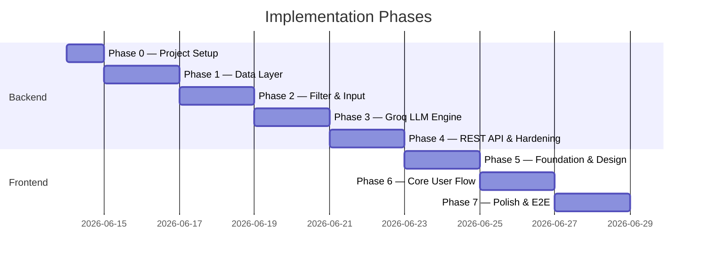
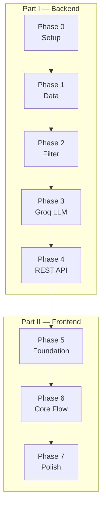

# Implementation Plan: AI-Powered Restaurant Recommendation System

This document is a phase-wise execution plan derived from [context.md](./context.md) and [architecture.md](./architecture.md). The work is split into **two tracks**:

1. **Backend** — data pipeline, filtering, Groq LLM engine, and REST API
2. **Frontend** — a polished, **desktop-first** web UI (laptop/browser) that consumes the API

Complete the backend track first. The frontend track starts once the API is stable enough to integrate against. **Mobile-responsive layouts are out of scope for the initial milestone** — optimize for 1280px–1440px laptop viewports first; smaller breakpoints can follow in a later phase.

---

## Plan Overview



| Track | Phase | Name | Primary outcome |
|-------|-------|------|-----------------|
| Backend | 0 | Project Setup | Runnable skeleton, dependencies, config |
| Backend | 1 | Data Layer | Hugging Face dataset loaded, preprocessed, cached |
| Backend | 2 | Filter & Input | Preferences validated; deterministic candidate filtering |
| Backend | 3 | Groq LLM Engine | Ranked recommendations with AI explanations |
| Backend | 4 | REST API & Hardening | FastAPI endpoints, error handling, backend tests |
| Frontend | 5 | Foundation & Design System | Next.js app, desktop layout shell, design tokens, API client |
| Frontend | 6 | Core User Flow | Two-column form + results, loading/error states |
| Frontend | 7 | Polish & E2E | Desktop polish, accessibility, hover states, full QA |

**Estimated total:** ~15 working days (backend ~9 days, frontend ~6 days).

---

# Part I — Backend

---

## Phase 0 — Project Setup

**Goal:** Establish the repository structure, dependencies, and configuration so later phases can be built incrementally.

### Tasks

| # | Task | File(s) |
|---|------|---------|
| 0.1 | Create directory layout per architecture | `src/`, `tests/`, `data/`, `docs/` |
| 0.2 | Add `requirements.txt` | `datasets`, `pandas`, `groq`, `pydantic`, `pydantic-settings`, `python-dotenv`, `pytest` |
| 0.3 | Add API deps | `fastapi`, `uvicorn`, `httpx` (for API tests) |
| 0.4 | Create `.env.example` | `GROQ_API_KEY`, `GROQ_MODEL`, `GROQ_TEMPERATURE`, `HF_DATASET_NAME`, `DATA_CACHE_PATH`, `CORS_ORIGINS` |
| 0.5 | Add `.gitignore` | Ignore `.env`, `data/`, `__pycache__/`, `.pytest_cache/`, `frontend/node_modules/` |
| 0.6 | Implement `config.py` | Centralize settings with `pydantic-settings` |
| 0.7 | Define core dataclasses (stubs) | `src/models/restaurant.py`, `preferences.py`, `recommendation.py` |
| 0.8 | Add minimal `README.md` | Setup instructions, env vars, how to run (placeholder) |

### Deliverables

- Empty but importable `src` package
- `config.py` reading env vars with sensible defaults
- `.env.example` documenting all required variables

### Acceptance Criteria

- [ ] `pip install -r requirements.txt` succeeds
- [ ] `python -c "from src.config import settings"` runs without error
- [ ] `.env` is gitignored; `.env.example` is committed

### Verification

```bash
python -m venv .venv && source .venv/bin/activate
pip install -r requirements.txt
python -c "from src.config import settings; print(settings.GROQ_MODEL)"
```

---

## Phase 1 — Data Layer

**Goal:** Satisfy **context workflow step 1 (Data Ingestion)** — load the Zomato dataset from Hugging Face, preprocess it into a canonical schema, cache locally, and expose a queryable repository.

**Maps to architecture:** §3.1 Data Ingestion Layer

### Tasks

| # | Task | File(s) |
|---|------|---------|
| 1.1 | Implement `DatasetLoader` | `src/data/loader.py` — fetch `ManikaSaini/zomato-restaurant-recommendation` via `datasets` |
| 1.2 | Inspect raw columns | Document actual column names in code comments or a short inline mapping dict |
| 1.3 | Implement `DataPreprocessor` | `src/data/preprocessor.py` |
| 1.4 | Map to canonical `Restaurant` schema | name, location, cuisines (list), cost_for_two, rating, votes, rest_type |
| 1.5 | Parse cuisine strings | `"Italian, Chinese"` → `["Italian", "Chinese"]` |
| 1.6 | Coerce numeric fields | rating, cost_for_two; drop rows with invalid critical fields |
| 1.7 | Normalize locations | trim, title-case; optional city alias map |
| 1.8 | Derive `budget_tier` | low (≤500), medium (501–1500), high (>1500) — tune after inspecting distribution |
| 1.9 | Implement local cache | Save/load parquet or CSV to `data/` to skip re-download |
| 1.10 | Implement `RestaurantRepository` | `src/data/repository.py` — in-memory list/DataFrame with query helpers |
| 1.11 | Add repository helpers | `get_all()`, `get_locations()`, `get_cuisines()` |
| 1.12 | Write unit tests | `tests/test_preprocessor.py` with a small fixture DataFrame |

### Deliverables

- Preprocessed dataset cached at `data/restaurants.parquet` (or `.csv`)
- `RestaurantRepository` returning typed `Restaurant` objects
- Distinct locations and cuisines available for frontend dropdowns (Phase 6)

### Acceptance Criteria

- [ ] Dataset downloads from Hugging Face on first run
- [ ] Subsequent runs load from local cache
- [ ] Every `Restaurant` has non-empty `name`, `location`, and valid `rating`
- [ ] `get_locations()` returns a sorted, deduplicated list (e.g. includes Delhi, Bangalore)
- [ ] `get_cuisines()` returns vocabulary extracted from dataset
- [ ] Preprocessor unit tests pass

### Verification

```bash
pytest tests/test_preprocessor.py -v
python -c "
from src.data.loader import load_restaurants
from src.data.repository import RestaurantRepository
repo = RestaurantRepository(load_restaurants())
print(len(repo.get_all()), 'restaurants')
print(repo.get_locations()[:5])
"
```

### Notes

- Inspect the Hugging Face dataset schema before writing column mappings — column names may differ from assumptions in architecture.md.
- Log row counts before/after preprocessing (dropped rows, null handling).

---

## Phase 2 — Filter & User Input

**Goal:** Satisfy **context workflow steps 2 (User Input) and 3 (Integration Layer — filtering half)** — validate preferences and deterministically filter restaurants before any LLM call.

**Maps to architecture:** §3.2 User Input Layer, §3.3.1 Restaurant Filter

### Tasks

| # | Task | File(s) |
|---|------|---------|
| 2.1 | Finalize `UserPreferences` model | `src/models/preferences.py` — Pydantic model with validators |
| 2.2 | Implement `PreferenceValidator` | Enforce location, budget enum, min_rating bounds |
| 2.3 | Implement `PreferenceNormalizer` | Lowercase cuisine, trim text, city alias normalization |
| 2.4 | Validate location against dataset | Reject unknown locations; suggest closest matches from `get_locations()` |
| 2.5 | Implement `RestaurantFilter` | `src/services/filter.py` |
| 2.6 | Filter pipeline | location → budget_tier → min_rating → cuisine (optional) |
| 2.7 | Sort and cap candidates | rating desc, votes desc; top N (default 15–20, configurable) |
| 2.8 | Constraint relaxation | If zero results: relax cuisine → budget → min_rating; attach warning flag |
| 2.9 | Write unit tests | `tests/test_filter.py` using frozen 10–20 row fixture |

### Deliverables

- `RestaurantFilter.filter(restaurants, preferences) -> FilterResult` returning candidates + metadata (filters applied, warnings)
- Validated `UserPreferences` object ready for prompt builder (Phase 3)

### Acceptance Criteria

- [ ] Invalid budget value raises validation error
- [ ] `min_rating` outside `[0.0, 5.0]` is rejected
- [ ] Filter by location "Bangalore" returns only Bangalore restaurants
- [ ] Budget filter uses derived `budget_tier` from Phase 1
- [ ] Optional cuisine filter matches if cuisine appears in restaurant's cuisine list
- [ ] Result count capped at `MAX_CANDIDATES_FOR_LLM`
- [ ] Zero-result scenario triggers relaxation and returns a warning
- [ ] All filter unit tests pass

### Verification

```bash
pytest tests/test_filter.py -v
python -c "
from src.data.loader import load_restaurants
from src.data.repository import RestaurantRepository
from src.services.filter import RestaurantFilter
from src/models.preferences import UserPreferences

repo = RestaurantRepository(load_restaurants())
prefs = UserPreferences(location='Bangalore', budget='medium', min_rating=4.0, cuisine='Italian')
result = RestaurantFilter().filter(repo.get_all(), prefs)
print(len(result.candidates), 'candidates')
"
```

---

## Phase 3 — Groq LLM Recommendation Engine

**Goal:** Satisfy **context workflow steps 3 (Integration Layer — prompt) and 4 (Recommendation Engine)** — build prompts, call Groq, parse JSON, enrich with structured data, and produce final recommendations.

**Maps to architecture:** §3.3.2 Prompt Builder, §3.4 Recommendation Engine, Groq Integration

### Tasks

| # | Task | File(s) |
|---|------|---------|
| 3.1 | Implement `PromptBuilder` | `src/services/prompt_builder.py` |
| 3.2 | System prompt | Role, JSON-only output, rank from CANDIDATES only |
| 3.3 | User prompt sections | Preferences, candidate JSON array, task (top K + explanations + summary) |
| 3.4 | Implement `LLMClient` | `src/services/llm_client.py` — Groq SDK wrapper |
| 3.5 | Configure Groq call | model, temperature, `response_format={"type": "json_object"}` where supported |
| 3.6 | Add retry logic | Invalid JSON → retry with lower temperature; 429 → exponential backoff |
| 3.7 | Implement `ResponseParser` | Parse and validate JSON schema |
| 3.8 | Implement `RecommendationEnricher` | Join LLM output (id, rank, explanation) with `Restaurant` records |
| 3.9 | Implement `RecommendationService` | `src/services/recommendation.py` — orchestrate full pipeline |
| 3.10 | Implement fallback ranking | If Groq fails: heuristic top-K by rating with generic explanation |
| 3.11 | Finalize output models | `Recommendation`, `RecommendationResponse` with metadata |
| 3.12 | Write tests | `tests/test_recommendation.py` — mock Groq client; `tests/test_prompt_builder.py` (snapshot) |

### Deliverables

- End-to-end `RecommendationService.recommend(preferences) -> RecommendationResponse`
- Each recommendation includes: name, cuisine, rating, estimated cost, AI explanation
- Optional summary string at response level

### Acceptance Criteria

- [ ] Prompt includes all candidate restaurants and all preference fields
- [ ] Groq API called with `GROQ_API_KEY` from env
- [ ] LLM returns only restaurant IDs from the candidate list (enricher validates)
- [ ] Parsed response matches expected JSON schema
- [ ] `RecommendationResponse.metadata` includes `candidates_considered`, `filters_applied`, `model`
- [ ] Fallback ranking works when Groq client is mocked to fail
- [ ] Integration test with mocked LLM passes

### Verification

```bash
# Requires GROQ_API_KEY in .env for live test
pytest tests/test_recommendation.py -v

python -c "
from src.services.recommendation import RecommendationService
from src.models.preferences import UserPreferences

svc = RecommendationService()
prefs = UserPreferences(location='Delhi', budget='low', min_rating=3.5, cuisine='Chinese')
response = svc.recommend(prefs)
for r in response.recommendations:
    print(r.rank, r.name, r.rating, r.explanation[:80])
"
```

### Groq Configuration Reference

| Variable | Default |
|----------|---------|
| `GROQ_API_KEY` | *(required)* |
| `GROQ_MODEL` | `llama-3.3-70b-versatile` |
| `GROQ_TEMPERATURE` | `0.3` |
| `TOP_K_RECOMMENDATIONS` | `5` |
| `MAX_CANDIDATES_FOR_LLM` | `20` |

---

## Phase 4 — REST API & Backend Hardening

**Goal:** Expose the recommendation pipeline as a stable REST API for the frontend. Harden error handling, logging, and backend tests before UI work begins.

**Maps to architecture:** §7 API Design, §9 Cross-Cutting Concerns, §11 Testing Strategy

### Tasks

| # | Task | File(s) |
|---|------|---------|
| 4.1 | Create FastAPI app | `src/api/app.py` — lifespan hook to preload dataset at startup |
| 4.2 | Define request/response schemas | `src/api/schemas.py` — mirror Pydantic models for OpenAPI |
| 4.3 | Implement `POST /api/v1/recommend` | Accept preferences JSON; return `RecommendationResponse` |
| 4.4 | Implement `GET /api/v1/locations` | Return sorted distinct locations for dropdowns |
| 4.5 | Implement `GET /api/v1/cuisines` | Return sorted distinct cuisines for dropdowns |
| 4.6 | Implement `GET /api/v1/health` | Return service status, dataset loaded flag |
| 4.7 | Configure CORS | Allow frontend origin(s) via `CORS_ORIGINS` env var |
| 4.8 | Structured error responses | 422 validation errors with field-level detail; 503 when dataset unavailable |
| 4.9 | Error handling audit | Dataset download retry, Groq 429 backoff, JSON parse retry |
| 4.10 | Logging | Filter counts, Groq latency, token usage (no API keys in logs) |
| 4.11 | API integration tests | `tests/test_api.py` — TestClient with mocked LLM |
| 4.12 | Complete backend test suite | All unit + integration tests green |
| 4.13 | Add test fixtures | `tests/fixtures/sample_restaurants.json` (10–20 rows) |
| 4.14 | Optional CLI for dev | `src/ui/cli.py` — interactive prompts without web UI |
| 4.15 | Wire entry point | `src/main.py` — launch uvicorn |
| 4.16 | Backend README section | Document API endpoints, curl examples, env vars |

### API Contract (for frontend integration)

**`POST /api/v1/recommend`**

```json
// Request
{
  "location": "Bangalore",
  "budget": "medium",
  "cuisine": "Italian",
  "min_rating": 4.0,
  "additional_preferences": "family-friendly, quick service"
}

// Response
{
  "summary": "Based on your preference for Italian cuisine in Bangalore...",
  "recommendations": [
    {
      "rank": 1,
      "name": "Example Ristorante",
      "cuisine": "Italian, Continental",
      "rating": 4.5,
      "estimated_cost": 1200,
      "explanation": "Highly rated Italian spot within your budget..."
    }
  ],
  "metadata": {
    "candidates_considered": 18,
    "filters_applied": { "location": "Bangalore", "budget": "medium", "min_rating": 4.0, "cuisine": "Italian" },
    "model": "llama-3.3-70b-versatile",
    "warnings": []
  }
}
```

### Deliverables

- Runnable API: `uvicorn src.api.app:app --reload --port 8000`
- OpenAPI docs at `/docs`
- Stable JSON contract the frontend can build against
- Backend test suite passing via `pytest`

### Acceptance Criteria

- [ ] All four API routes return correct status codes and JSON shapes
- [ ] CORS allows the frontend dev server (`http://localhost:3000`)
- [ ] Validation errors return 422 with actionable field messages
- [ ] Missing `GROQ_API_KEY` returns clear error before API call
- [ ] Groq failure triggers fallback ranking (not a 500)
- [ ] Empty filter results return structured response with warnings
- [ ] `pytest` passes with no failures
- [ ] No secrets committed to git

### Verification

```bash
pytest -v
uvicorn src.api.app:app --reload --port 8000

# In another terminal:
curl http://localhost:8000/api/v1/health
curl http://localhost:8000/api/v1/locations
curl -X POST http://localhost:8000/api/v1/recommend \
  -H "Content-Type: application/json" \
  -d '{"location":"Bangalore","budget":"medium","cuisine":"Italian","min_rating":4.0}'
```

### Backend QA Checklist

| Scenario | Expected behavior |
|----------|-------------------|
| Valid preferences | 200 with 5 recommendations and explanations |
| Unknown location | 422 with validation error + location suggestions |
| Very strict filters (no matches) | 200 with relaxed filters warning or empty recommendations |
| Missing `GROQ_API_KEY` | 503 or 500 with clear message before Groq call |
| Groq returns malformed JSON | Retry, then fallback ranking |
| Network timeout | Fallback ranking with notice in metadata |

---

# Part II — Frontend

The frontend is a **separate Next.js application** in `frontend/`. It communicates exclusively with the FastAPI backend via REST. No business logic (filtering, LLM calls) lives in the frontend.

### Design approach: desktop web first

This milestone targets **laptop and desktop browsers** as the primary testing and delivery surface:

| Priority | Viewport | Layout |
|----------|----------|--------|
| **Primary** | 1280px–1440px (laptop) | Two-column: preferences left (~40%), results right (~60%) |
| **Secondary** | 1440px+ (large monitor) | Same layout with wider max-width container (1200px) |
| **Deferred** | &lt;1280px (tablet/mobile) | Not required for initial milestone |

Visual design follows the **Epicurean Standard** design system produced in Google Stitch — see [`stitch_zomato_ai_recommendations/epicurean_standard/DESIGN.md`](../stitch_zomato_ai_recommendations/epicurean_standard/DESIGN.md) for colors, typography, spacing, and component specs.

### Frontend Tech Stack

| Layer | Choice | Rationale |
|-------|--------|-----------|
| Framework | **Next.js 15** (App Router) | File-based routing, SSR optional, strong TypeScript support |
| Language | **TypeScript** | Type-safe API contracts shared with backend response shapes |
| Styling | **Tailwind CSS** | Utility-first, fast iteration, consistent spacing/typography |
| Components | **shadcn/ui** | Accessible, customizable primitives (Select, Slider, Card, Button) |
| Forms | **React Hook Form + Zod** | Validated forms with client-side feedback before API call |
| Data fetching | **TanStack Query** | Caching, loading/error states, retry for `/recommend` |
| Icons | **Lucide React** | Consistent icon set for ratings, location, cuisine |

### Frontend Quality Bar

The UI should feel like a real product — not a prototype. Target these standards:

- **Visual design:** Epicurean Standard / Zomato-inspired palette (warm red `#E23744` / `#b7122a`, clean whites, light gray panels), generous whitespace, Inter typography — per Stitch `DESIGN.md`
- **Layout:** Desktop-first two-column split; fixed header, centered 1200px max-width content, footer; mouse-optimized (hover lift on cards, no touch-first patterns)
- **States:** Skeleton loaders during fetch, empty state with guidance, inline validation errors, toast/banner for API failures
- **Accessibility:** Keyboard-navigable form, ARIA labels on controls, sufficient color contrast (WCAG AA)
- **Performance:** Dropdown data cached via TanStack Query; debounced additional-preferences input optional
- **Micro-interactions:** Card hover elevation, rank badge styling (gold/silver/bronze), staggered fade-in on results reveal

---

## Phase 5 — Frontend Foundation & Design System

**Goal:** Scaffold the Next.js app, establish the desktop design system, and wire up the typed API client.

### Tasks

| # | Task | File(s) |
|---|------|---------|
| 5.1 | Scaffold Next.js app | `frontend/` — App Router, TypeScript, Tailwind, ESLint |
| 5.2 | Install shadcn/ui | Initialize with base components: Button, Card, Select, Slider, Input, Label, Badge, Skeleton, Toast |
| 5.3 | Configure design tokens | `frontend/app/globals.css` — map Epicurean Standard tokens (primary, surfaces, typography, spacing from `DESIGN.md`) |
| 5.4 | Create desktop layout shell | `frontend/app/layout.tsx` — full-width header (logo + title + tagline), centered 1200px main, footer |
| 5.5 | Create two-column page scaffold | `frontend/app/page.tsx` — left panel "Your preferences" (~40%), right panel "Recommendations" (~60%) |
| 5.6 | Define TypeScript types | `frontend/lib/types.ts` — mirror backend `RecommendationResponse`, `UserPreferences` |
| 5.7 | Implement API client | `frontend/lib/api.ts` — typed fetch wrappers for all four endpoints |
| 5.8 | Configure TanStack Query | `frontend/app/providers.tsx` — QueryClientProvider wrapper |
| 5.9 | Environment config | `frontend/.env.local.example` — `NEXT_PUBLIC_API_URL=http://localhost:8000` |
| 5.10 | Add dev proxy (optional) | `frontend/next.config.ts` — rewrite `/api/*` to backend in dev |

### Deliverables

- Runnable frontend: `cd frontend && npm run dev` → `http://localhost:3000`
- Typed API client fetching locations/cuisines from backend
- Design system tokens and base layout in place

### Acceptance Criteria

- [ ] `npm run dev` starts without errors (backend must be running for data fetches)
- [ ] Desktop layout renders at 1280px+: header, two-column main, footer
- [ ] API client successfully fetches `/api/v1/locations` and `/api/v1/cuisines`
- [ ] TypeScript types match backend response shapes
- [ ] shadcn/ui components render with Epicurean Standard theme applied

### Verification

```bash
# Terminal 1 — backend
uvicorn src.api.app:app --reload --port 8000

# Terminal 2 — frontend
cd frontend && npm install && npm run dev
# Open http://localhost:3000 — verify layout and no console errors
```

---

## Phase 6 — Core User Flow

**Goal:** Satisfy **context workflow steps 2 (User Input) and 5 (Output Display)** — build the preference form in the left panel, results in the right panel, and wire the full submit flow.

### Tasks

| # | Task | File(s) |
|---|------|---------|
| 6.1 | Build `PreferenceForm` | `frontend/components/PreferenceForm.tsx` — lives in left column panel |
| 6.2 | Location select | Populated from `GET /locations`; searchable dropdown |
| 6.3 | Budget select | low / medium / high with helper labels (e.g. "Under ₹500") |
| 6.4 | Cuisine select | Populated from `GET /cuisines`; optional "Any cuisine" |
| 6.5 | Min rating slider | 0.0–5.0 with step 0.5; show current value |
| 6.6 | Additional preferences | Free-text textarea with placeholder examples |
| 6.7 | Client-side validation | Zod schema mirroring backend rules; inline error messages below fields |
| 6.8 | Submit handler | `useMutation` POST to `/recommend`; disable button while pending |
| 6.9 | Build `RecommendationCard` | `frontend/components/RecommendationCard.tsx` — rank badge, name, cuisine, rating, cost, explanation; hover lift |
| 6.10 | Build `ResultsPanel` | `frontend/components/ResultsPanel.tsx` — right column: summary banner + scrollable card list |
| 6.11 | Loading state | Skeleton cards in right column; message "AI is ranking restaurants for you…" |
| 6.12 | Empty state | Right column placeholder before submit; "No restaurants match" state with suggestions after |
| 6.13 | Error state | Inline errors in left form; dismissible alert bar below header for server errors |
| 6.14 | Applied filters bar | Horizontal chip row above results from `metadata.filters_applied` |
| 6.15 | Warnings display | Amber banner above results from `metadata.warnings` when filters were relaxed |

### Deliverables

- Complete preference → results flow on the home page
- All five required output fields visible per recommendation
- Graceful handling of loading, empty, and error states

### Acceptance Criteria

- [ ] User can select location, budget, cuisine, min rating, and additional preferences in the left panel
- [ ] Invalid input shows inline validation before submit
- [ ] Submit triggers API call; button disabled and right-column skeletons shown during load
- [ ] Results render as ranked cards in the right panel with name, cuisine, rating, cost, explanation
- [ ] LLM summary displayed in summary banner when present
- [ ] "No results" state suggests broadening filters
- [ ] Unknown location error from API displayed on the form with suggestion chips
- [ ] Full pipeline completes without manual intervention at 1280px viewport

### Verification

```bash
# Manual E2E: Bangalore, medium, Italian, 4.0 → verify 5 cards with explanations
npm run dev   # frontend on :3000, backend on :8000
```

### UI Wireframe (desktop, 1280px)

```
┌──────────────────────────────────────────────────────────────────────────┐
│  🍽  Zomato AI Recommendations              Find your perfect restaurant │
├──────────────────────────────────────────────────────────────────────────┤
│                                                                          │
│  ┌─ Your preferences (40%) ──┐  ┌─ Recommendations (60%) ─────────────┐ │
│  │ Location    [Bangalore ▼] │  │ Bangalore · medium · Italian · ≥4.0 │ │
│  │ Budget      [medium    ▼] │  │ ┌─ AI Summary ─────────────────────┐ │ │
│  │ Cuisine     [Italian   ▼] │  │ │ "Based on your preferences…"   │ │ │
│  │ Min Rating  [────●── 4.0] │  │ └────────────────────────────────┘ │ │
│  │ Additional  [            ] │  │ ┌ #1 ────────────────────────────┐ │ │
│  │                             │  │ │ Italian Garden    ★4.5  ₹1200  │ │ │
│  │ [ Get Recommendations     ] │  │ │ Italian, Continental             │ │ │
│  └─────────────────────────────┘  │ │ "Highly rated spot within…"    │ │ │
│                                    │ └────────────────────────────────┘ │ │
│                                    │ (... #2 – #5 cards, hover lift ...) │ │
│                                    └────────────────────────────────────┘ │
│                                                                          │
├──────────────────────────────────────────────────────────────────────────┤
│                        © Zomato AI Recommendations                       │
└──────────────────────────────────────────────────────────────────────────┘
```

---

## Phase 7 — Frontend Polish & End-to-End Integration

**Goal:** Elevate the desktop UI to production quality — typography, hover states, accessibility, and full manual QA on laptop viewports.

### Tasks

| # | Task | File(s) |
|---|------|---------|
| 7.1 | Desktop layout refinement | Fine-tune 40/60 column split, 1200px max-width, 32px edge margins, vertical divider between panels |
| 7.2 | Typography & spacing pass | Apply Epicurean Standard scale; consistent heading hierarchy, 1.5× line-height on explanations |
| 7.3 | Rating display component | Star icons + numeric rating; cost formatted as `₹1,200 for two` |
| 7.4 | Rank badge styling | Gold/silver/bronze accents for #1–#3; subtle for #4–#5 |
| 7.5 | Card hover & reveal | Shadow lift on hover (`0px 8px 24px rgba(28,28,28,0.12)`); staggered fade-in on results load |
| 7.6 | Accessibility audit | Focus rings, ARIA labels, keyboard submit (Enter), screen-reader-friendly cards |
| 7.7 | Error boundary | `frontend/app/error.tsx` — graceful fallback for unexpected crashes |
| 7.8 | SEO & metadata | Page title, description, Open Graph tags |
| 7.9 | Loading copy | Contextual message: "AI is ranking restaurants for you…" |
| 7.10 | Fallback notice | Banner when backend used heuristic ranking (no AI explanation) |
| 7.11 | Frontend README | `frontend/README.md` — setup, env vars, dev workflow |
| 7.12 | Update root README | Full-stack setup: backend + frontend run instructions |
| 7.13 | Manual QA checklist | Run through all edge cases at 1280px (see below) |
| 7.14 | Optional smoke script | `scripts/smoke_test.sh` — curl backend + check frontend builds |
| 7.15 | *(Future)* Mobile/tablet breakpoints | Defer `<1280px` responsive stacking to a post-milestone phase |

### Deliverables

- Polished desktop web application (1280px+ primary viewport)
- Complete documentation for full-stack local development
- Manual QA sign-off on all edge cases

### Acceptance Criteria

- [ ] Layout works correctly at 1280px and 1440px desktop widths
- [ ] Two-column split remains stable; no horizontal scroll at target viewports
- [ ] All interactive elements are keyboard-accessible
- [ ] Color contrast meets WCAG AA
- [ ] Card hover states provide clear mouse feedback
- [ ] No console errors during normal flow
- [ ] `npm run build` succeeds (production build)
- [ ] README documents how to run backend + frontend together
- [ ] All manual QA scenarios pass

### Manual QA Checklist

| Scenario | Expected behavior |
|----------|-------------------|
| Valid preferences | 5 recommendation cards with explanations |
| Unknown location | Inline validation error + suggestions |
| Very strict filters | Empty state or warning banner with guidance |
| Backend down | Toast error: "Unable to reach server" |
| Slow Groq response | Skeleton loaders visible for full duration in right column |
| Laptop viewport (1280px) | Two-column layout; form left, results right; no overflow |
| Keyboard only | Tab through form, submit with Enter |

### Verification

```bash
pytest -v                                    # backend tests
cd frontend && npm run build                 # production build
npm run dev                                  # manual QA
```

---

## Phase Dependencies



The frontend track **starts after Phase 4**. Phases 5–7 can overlap slightly (e.g. start layout in Phase 5 while API contract is finalized), but do not build UI against unstable endpoints.

---

## Requirements Traceability

Maps [context.md](./context.md) requirements to implementation phases.

| Context requirement | Phase |
|---------------------|-------|
| Load Zomato dataset from Hugging Face | Backend 1 |
| Extract name, location, cuisine, cost, rating | Backend 1 |
| Filter data based on user input | Backend 2 |
| Pass structured results into LLM prompt | Backend 3 |
| LLM ranks restaurants | Backend 3 |
| LLM provides explanations | Backend 3 |
| Optional summary of choices | Backend 3, Frontend 6 |
| Collect location, budget, cuisine, min rating, additional prefs | Frontend 6 |
| Display name, cuisine, rating, cost, explanation | Frontend 6 |
| REST API for frontend decoupling | Backend 4 |

---

## File Checklist (Final State)

By end of Phase 7, the repository should contain:

```
zomato-milestone1/
├── docs/
│   ├── context.md
│   ├── architecture.md
│   ├── implementation-plan.md
│   └── problemStatement.txt
├── stitch_zomato_ai_recommendations/
│   └── epicurean_standard/
│       └── DESIGN.md            # Google Stitch design system (desktop-first)
├── frontend/
│   ├── app/
│   │   ├── layout.tsx
│   │   ├── page.tsx
│   │   ├── providers.tsx
│   │   ├── globals.css
│   │   └── error.tsx
│   ├── components/
│   │   ├── PreferenceForm.tsx
│   │   ├── RecommendationCard.tsx
│   │   ├── ResultsPanel.tsx
│   │   └── ui/                  # shadcn/ui primitives
│   ├── lib/
│   │   ├── api.ts
│   │   └── types.ts
│   ├── .env.local.example
│   ├── package.json
│   ├── tailwind.config.ts
│   └── README.md
├── src/
│   ├── __init__.py
│   ├── main.py
│   ├── config.py
│   ├── models/
│   │   ├── restaurant.py
│   │   ├── preferences.py
│   │   └── recommendation.py
│   ├── data/
│   │   ├── loader.py
│   │   ├── preprocessor.py
│   │   └── repository.py
│   ├── services/
│   │   ├── filter.py
│   │   ├── prompt_builder.py
│   │   ├── llm_client.py
│   │   └── recommendation.py
│   ├── api/
│   │   ├── app.py
│   │   ├── routes.py
│   │   └── schemas.py
│   └── ui/
│       └── cli.py               # optional dev tool
├── tests/
│   ├── fixtures/
│   │   └── sample_restaurants.json
│   ├── test_preprocessor.py
│   ├── test_filter.py
│   ├── test_recommendation.py
│   ├── test_prompt_builder.py
│   └── test_api.py
├── data/                        # gitignored cache
├── .env.example
├── .gitignore
├── requirements.txt
└── README.md
```

---

## Risk Register

| Risk | Impact | Mitigation | Phase |
|------|--------|------------|-------|
| Hugging Face dataset schema differs from assumptions | Preprocessing breaks | Inspect dataset in Phase 1 before mapping columns | Backend 1 |
| Budget thresholds don't match data distribution | Poor budget filtering | Plot `cost_for_two` distribution; tune thresholds | Backend 1 |
| Groq returns invalid JSON | No recommendations shown | Retry + fallback heuristic ranking | Backend 3, 4 |
| Groq rate limits (429) | Slow or failed requests | Exponential backoff; use `llama-3.1-8b-instant` in dev | Backend 3, 4 |
| Location names inconsistent in dataset | Filter misses matches | Normalize + alias map in preprocessor | Backend 1, 2 |
| LLM hallucinates restaurants not in list | Wrong recommendations | Enricher validates IDs against candidate set | Backend 3 |
| CORS blocks frontend dev server | API calls fail | Configure `CORS_ORIGINS` in Backend 4 | Backend 4 |
| Long Groq latency (>10s) | Poor UX | Skeleton loaders in right column, contextual loading copy | Frontend 6, 7 |
| Desktop-only scope delays mobile users | Limited reach on phones | Accept for milestone; add responsive breakpoints post-milestone (Phase 7.15) | Frontend 7 |
| API contract drift | Frontend breaks | Define schemas in Backend 4; mirror in `frontend/lib/types.ts` | Backend 4, Frontend 5 |

---

## Definition of Done (Project)

The milestone is complete when:

1. **Backend:** User preferences flow through filter → Groq → structured JSON via REST API.
2. **Backend:** Real Zomato data loads from Hugging Face; deterministic filtering narrows candidates before the LLM call.
3. **Backend:** Groq ranks restaurants and generates explanations (and optional summary); fallback works on failure.
4. **Backend:** All API routes documented; backend tests pass; errors handled gracefully.
5. **Frontend:** Polished Next.js desktop UI collects preferences (left panel) and displays top recommendations (right panel) with all five required fields.
6. **Frontend:** Loading, empty, and error states are handled; layout is optimized for laptop/desktop browsers and accessible.
7. **Full stack:** README documents how to run backend + frontend together; no secrets committed to git.

---

## Related Documents

- [context.md](./context.md) — product requirements and workflow
- [architecture.md](./architecture.md) — technical architecture and component design
- [problemStatement.txt](./problemStatement.txt) — original problem statement
- [../stitch_zomato_ai_recommendations/epicurean_standard/DESIGN.md](../stitch_zomato_ai_recommendations/epicurean_standard/DESIGN.md) — desktop-first UI design system (Google Stitch)
